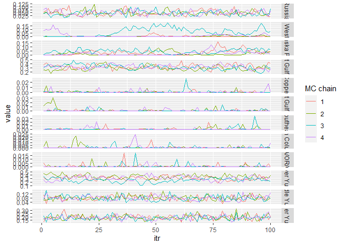

<!-- README.md is generated from README.Rmd. Please edit that file -->

# Ms.GSI <a href="https://boppingshoe.github.io/Ms.GSI/"></a>

<!-- badges: start -->
<!-- badges: end -->

*Ms.GSI* is here to help you conducting multistage genetic stock
identification. This package includes functions to setup input data, run
the multistage model, and make summary statistics and convergence
diagnostics. It also includes a function for making trace plots.

## Installation

You can install the development version of *Ms.GSI* from
[GitHub](https://github.com/boppingshoe/Ms.GSI) with:

``` r
# install.packages("devtools")
devtools::install_github("boppingshoe/Ms.GSI", build_vignettes = TRUE)
```

## Example

This example shows the basic workflows for running a multistage model.
First thing first, the background: we made up a scenario where we have
samples for Chinook salmon bycatch from Bering Sea groundfish fisheries.
The mixture sample contains Chinook from all over the North Pacific, but
we are interested in contribution from the Yukon River. We will conduct
GSI using a broad-scale baseline (`base_templin`) in combination with a
regional baseline (`base_yukon`) in a multistage framework.

The fake Chinook data sets are pre-loaded in the *Ms.GSI* package. Here
we prepare the input data:

``` r

library(Ms.GSI)

msgsi_dat <-
  prep_msgsi_data(mixture_data = mix,
  baseline1_data = base_templin, baseline2_data = base_yukon,
  pop1_info = templin_pops211, pop2_info = yukon_pops50, sub_group = 3:5)
#> Compiling input data, may take a minute or two...
#> Time difference of 7.569319 secs
```

Using the prepared input data, we run the model with four chains of 150
iterations. In reality, you should of course run it with more
iterations. We set the first 50 iterations in each chain as the warm-ups
(not kept in the final output). Here’s the summary for the estimates and
convergence diagnostics.

``` r

msgsi_out <- msgsi_mdl(msgsi_dat, nreps = 150, nburn = 50, thin = 1, nchains = 4)
#> Running model (and the category is... Femme Queen Vogue!)
#> Time difference of 1.685267 secs
#> April-21-2025 10:23

msgsi_out$summ_comb
#> # A tibble: 12 × 9
#>    group                 mean  median      sd    ci.05   ci.95    p0    GR n_eff
#>    <chr>                <dbl>   <dbl>   <dbl>    <dbl>   <dbl> <dbl> <dbl> <dbl>
#>  1 Russia             2.27e-2 1.91e-2 0.0213  8.31e-12 0.0634  0.11   1.35 102. 
#>  2 Coastal West Alas… 9.83e-2 6.30e-2 0.110   1.21e-12 0.305   0.165  3.01  58.4
#>  3 North Alaska Peni… 1.33e-2 9.47e-4 0.0204  1.06e-15 0.0535  0.265  1.20  58.8
#>  4 Northwest Gulf of… 3.70e-1 3.72e-1 0.104   2.02e- 1 0.548   0      1.42  34.9
#>  5 Copper             7.05e-4 6.04e-7 0.00258 1.49e-20 0.00433 0.49   1.01 336. 
#>  6 Northeast Gulf of… 5.48e-4 1.08e-6 0.00195 1.11e-19 0.00258 0.475  1.02 400  
#>  7 Coastal Southeast… 1.51e-3 3.36e-6 0.00449 4.26e-18 0.00948 0.415  1.10 183. 
#>  8 British Columbia   6.31e-4 9.65e-7 0.00191 1.03e-18 0.00384 0.455  1.08 278. 
#>  9 WA/OR/CA           5.13e-4 8.51e-7 0.00158 3.24e-18 0.00288 0.492  1.04 371. 
#> 10 Lower Yukon        2.42e-1 2.58e-1 0.136   3.23e- 2 0.447   0      2.37 103. 
#> 11 Middle Yukon       7.03e-2 6.85e-2 0.0229  3.61e- 2 0.110   0      1.03 433. 
#> 12 Upper Yukon        1.79e-1 1.81e-1 0.0339  1.29e- 1 0.244   0      1.03 468.
```

There’s a function in the package to make trace plots and inspect mixing
of chains.

``` r

tr_plot(obj = msgsi_out$trace_comb, pop_info = msgsi_out$comb_groups)
```



Details of the mathematical model of integrated multistage framework and
instructions for using *Ms.GSI* package can be found in the “articles”
tab of the package website. Or, once you installed *Ms.GSI*, you can
call the article using `vignette("msgsi_vignette")`.
