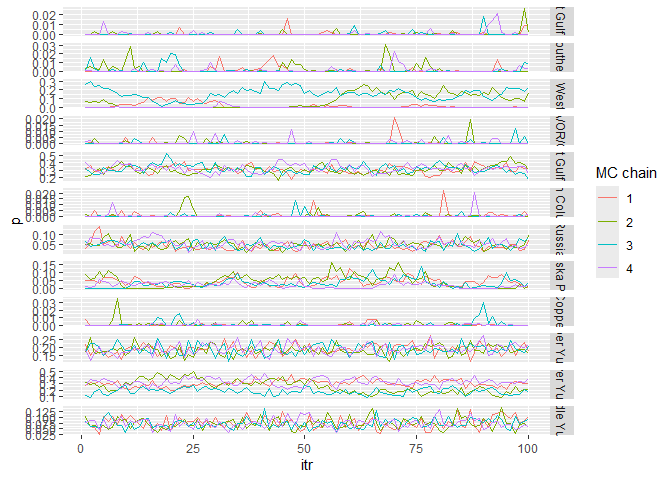

<!-- README.md is generated from README.Rmd. Please edit that file -->

# Ms.GSI <a href="https://boppingshoe.github.io/Ms.GSI/"></a>

<!-- badges: start -->

<!-- badges: end -->

*Ms.GSI* is here to help you conducting multistage genetic stock
identification. This package includes functions to setup input data, run
the multistage model, and make summary statistics and convergence
diagnostics. It also includes a function for making trace plots.

## Installation

You can install the development version of *Ms.GSI* from
[GitHub](https://github.com/boppingshoe/Ms.GSI) with:

``` r
# install.packages("devtools")
devtools::install_github("boppingshoe/Ms.GSI", build_vignettes = TRUE)
```

## Example

This example shows the basic workflows for running a multistage model.
First thing first, the background: we made up a scenario where we have
samples for Chinook salmon bycatch from Bering Sea groundfish fisheries.
The mixture sample contains Chinook from all over the North Pacific, but
we are interested in contribution from the Yukon River. We will conduct
GSI using a broad-scale baseline (`base_templin`) in combination with a
regional baseline (`base_yukon`) in a multistage framework.

The fake Chinook data sets are pre-loaded in the *Ms.GSI* package. Here
we prepare the input data:

``` r

library(Ms.GSI)

msgsi_dat <-
  prep_msgsi_data(mixture_data = mix,
  baseline1_data = base_templin, baseline2_data = base_yukon,
  pop1_info = templin_pops211, pop2_info = yukon_pops50, sub_group = 3:5,
  harvest_mean = 500, harvest_cv = 0.05)
#> Compiling input data, may take a minute or two...
#> Time difference of 6.868659 secs
```

Using the prepared input data, we run the model with four chains of 150
iterations. In reality, you should of course run it with more
iterations. We set the first 50 iterations in each chain as the warm-ups
(not kept in the final output). Here’s the summary for the estimates and
convergence diagnostics.

``` r

msgsi_out <- msgsi_mdl(msgsi_dat, nreps = 150, nburn = 50, thin = 1, nchains = 4)
#> Running model... and your attitude determines your Snow Ball!
#> Time difference of 3.246345 secs
#> June-30-2026 14:24

msgsi_out$summ_comb
#> # A tibble: 12 × 10
#>    group           mean  median      sd    ci.05   ci.95    p0    z0    GR n_eff
#>    <chr>          <dbl>   <dbl>   <dbl>    <dbl>   <dbl> <dbl> <dbl> <dbl> <dbl>
#>  1 Russia       4.99e-2 4.69e-2 0.0207  2.05e- 2 0.0887  0     0      1.03 230. 
#>  2 Coastal Wes… 6.35e-2 1.38e-2 0.0801  3.09e-16 0.219   0.402 0.408  1.95  43.7
#>  3 North Alask… 3.67e-2 3.15e-2 0.0296  5.12e- 6 0.0943  0.09  0.085  1.13  94.6
#>  4 Northwest G… 3.15e-1 3.13e-1 0.0534  2.33e- 1 0.406   0     0      1.01 128. 
#>  5 Copper       9.25e-4 8.21e-6 0.00303 1.92e-18 0.00573 0.818 0.86   1.09 261. 
#>  6 Northeast G… 7.75e-4 7.37e-7 0.00267 2.54e-17 0.00447 0.855 0.872  1.01 306. 
#>  7 Coastal Sou… 1.49e-3 3.19e-6 0.00404 4.75e-18 0.00985 0.792 0.792  1.04 151. 
#>  8 British Col… 6.82e-4 1.82e-6 0.00243 5.09e-19 0.00343 0.858 0.902  1.01 292. 
#>  9 WA/OR/CA     6.11e-4 5.41e-7 0.00214 1.16e-17 0.00404 0.87  0.9    1.01 338. 
#> 10 Lower Yukon  2.69e-1 2.72e-1 0.0901  1.22e- 1 0.412   0     0      1.58 101. 
#> 11 Middle Yukon 7.42e-2 7.26e-2 0.0218  4.03e- 2 0.113   0     0      1.01 400  
#> 12 Upper Yukon  1.87e-1 1.85e-1 0.0320  1.35e- 1 0.243   0     0      1.01 400
```

Summary for the stock-specific harvest is called separately:

``` r

stratified_estimator_msgsi(msgsi_out, mixvec = "example")
#> # A tibble: 12 × 15
#>    repunit     mean_sstc sd_sstc median_sstc ci05_sstc ci95_sstc    mean      sd
#>    <chr>           <dbl>   <dbl>       <dbl>     <dbl>     <dbl>   <dbl>   <dbl>
#>  1 Northeast …     0.285   0.975         0           0      2    5.71e-4 0.00194
#>  2 Coastal So…     0.648   1.78          0           0      4    1.30e-3 0.00351
#>  3 Coastal We…    31.8    40.2           7.5         0    113.   6.37e-2 0.0801 
#>  4 WA/OR/CA        0.225   0.947         0           0      1    4.50e-4 0.00185
#>  5 Northwest …   156.     26.5         155         115    199.   3.15e-1 0.0493 
#>  6 British Co…     0.232   0.970         0           0      1.05 4.71e-4 0.00195
#>  7 Russia         24.4     9.20         23          12     41.0  4.92e-2 0.0181 
#>  8 North Alas…    18.4    14.1          16           0     43    3.72e-2 0.0283 
#>  9 Copper          0.37    1.45          0           0      2    7.44e-4 0.00292
#> 10 Upper Yukon    93.1    13.7          93          71    117    1.88e-1 0.0266 
#> 11 Lower Yukon   133.     42.8         135          64    203    2.70e-1 0.0867 
#> 12 Middle Yuk…    36.8     9.59         36          23     55    7.42e-2 0.0190 
#> # ℹ 7 more variables: median <dbl>, ci05 <dbl>, ci95 <dbl>, `P=0` <dbl>,
#> #   `Z=0` <dbl>, GR <dbl>, n_eff <dbl>
```

Individual assignment summary:

``` r

indiv_assign(msgsi_out, msgsi_dat)
#> # A tibble: 150 × 13
#>    ID      Russia `Coastal West Alaska` `North Alaska Peninsula`
#>  * <chr>    <dbl>                 <dbl>                    <dbl>
#>  1 fish_1  0                     0.128                    0     
#>  2 fish_2  0.0025                0.0975                   0.0275
#>  3 fish_3  0.03                  0.035                    0.255 
#>  4 fish_4  0                     0.222                    0.0225
#>  5 fish_5  0                     0.1                      0     
#>  6 fish_6  0                     0.185                    0.0025
#>  7 fish_7  0.11                  0.0775                   0.075 
#>  8 fish_8  0.145                 0.055                    0.035 
#>  9 fish_9  0.01                  0.09                     0.0025
#> 10 fish_10 0.0775                0.06                     0.0525
#> # ℹ 140 more rows
#> # ℹ 9 more variables: `Northwest Gulf of Alaska` <dbl>, Copper <dbl>,
#> #   `Northeast Gulf of Alaska` <dbl>, `Coastal Southeast Alaska` <dbl>,
#> #   `British Columbia` <dbl>, `WA/OR/CA` <dbl>, `Lower Yukon` <dbl>,
#> #   `Middle Yukon` <dbl>, `Upper Yukon` <dbl>
```

There’s a function in the package to make trace plots and inspect mixing
of chains.

``` r

tr_plot(mdl_out = msgsi_out, trace_obj = "trace_comb", pop_info = msgsi_out$comb_groups)
```



Details of the mathematical model of integrated multistage framework and
instructions for using *Ms.GSI* package can be found in the “articles”
tab of the package website. Or, once you installed *Ms.GSI*, you can
call the article using `vignette("msgsi_vignette")`.
