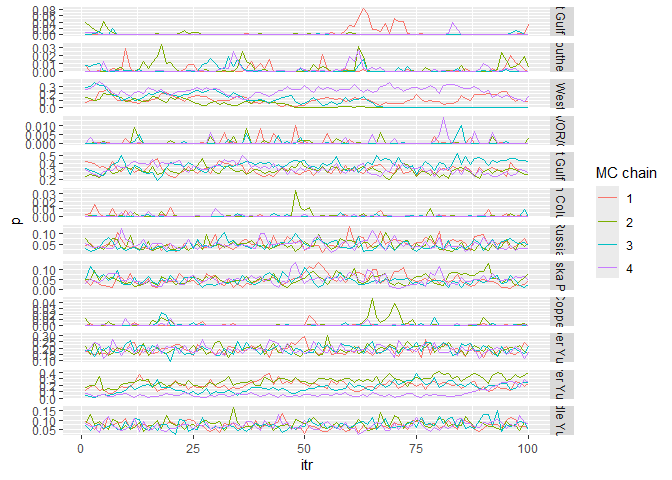

# Ms.GSI

*Ms.GSI* is here to help you conducting multistage genetic stock
identification. This package includes functions to setup input data, run
the multistage model, and make summary statistics and convergence
diagnostics. It also includes a function for making trace plots.

## Installation

You can install the development version of *Ms.GSI* from
[GitHub](https://github.com/boppingshoe/Ms.GSI) with:

``` r
# install.packages("devtools")
devtools::install_github("boppingshoe/Ms.GSI", build_vignettes = TRUE)
```

## Example

This example shows the basic workflows for running a multistage model.
First thing first, the background: we made up a scenario where we have
samples for Chinook salmon bycatch from Bering Sea groundfish fisheries.
The mixture sample contains Chinook from all over the North Pacific, but
we are interested in contribution from the Yukon River. We will conduct
GSI using a broad-scale baseline (`base_templin`) in combination with a
regional baseline (`base_yukon`) in a multistage framework.

The fake Chinook data sets are pre-loaded in the *Ms.GSI* package. Here
we prepare the input data:

``` r

library(Ms.GSI)

msgsi_dat <-
  prep_msgsi_data(mixture_data = mix,
  baseline1_data = base_templin, baseline2_data = base_yukon,
  pop1_info = templin_pops211, pop2_info = yukon_pops50, sub_group = 3:5,
  harvest_mean = 500, harvest_cv = 0.05)
#> Compiling input data, may take a minute or two...
#> Time difference of 7.764232 secs
```

Using the prepared input data, we run the model with four chains of 150
iterations. In reality, you should of course run it with more
iterations. We set the first 50 iterations in each chain as the warm-ups
(not kept in the final output). Here’s the summary for the estimates and
convergence diagnostics.

``` r

msgsi_out <- msgsi_mdl(msgsi_dat, nreps = 150, nburn = 50, thin = 1, nchains = 4)
#> Running model... and good things come to Best Dressed!
#> Time difference of 1.927239 secs
#> March-26-2026 13:23

msgsi_out$summ_comb
#> # A tibble: 12 × 10
#>    group           mean  median      sd    ci.05   ci.95    p0    GR n_eff    z0
#>    <chr>          <dbl>   <dbl>   <dbl>    <dbl>   <dbl> <dbl> <dbl> <dbl> <dbl>
#>  1 Russia       4.77e-2 4.42e-2 0.0202  2.13e- 2 0.0874   0.01  1.02 259.  0    
#>  2 Coastal Wes… 1.25e-1 1.10e-1 0.0979  1.58e-10 0.292    0.2   1.85  36.2 0.182
#>  3 North Alask… 4.69e-2 4.44e-2 0.0237  1.41e- 2 0.0873   0.08  1.01 143.  0    
#>  4 Northwest G… 3.37e-1 3.31e-1 0.0610  2.41e- 1 0.444    0     1.22 124.  0    
#>  5 Copper       1.24e-3 1.29e-6 0.00437 1.99e-19 0.00849  1     1.20 253.  0.945
#>  6 Northeast G… 2.54e-3 5.27e-6 0.00874 1.11e-17 0.0152   1     1.20 125.  0.89 
#>  7 Coastal Sou… 2.32e-3 3.15e-5 0.00512 3.89e-16 0.0122   1     1.04 148.  0.818
#>  8 British Col… 7.83e-4 1.39e-6 0.00267 4.98e-19 0.00429  1     1.10 319.  0.978
#>  9 WA/OR/CA     5.70e-4 2.08e-6 0.00166 8.82e-20 0.00379  1     1.01 248.  0.99 
#> 10 Lower Yukon  1.75e-1 1.82e-1 0.0970  2.88e- 2 0.335    0     2.03  45.8 0    
#> 11 Middle Yukon 7.21e-2 7.06e-2 0.0225  4.12e- 2 0.112    0     1.01 331.  0    
#> 12 Upper Yukon  1.88e-1 1.87e-1 0.0333  1.40e- 1 0.247    0     1.00 457.  0
```

Summary for the stock-specific harvest is called separately:

``` r

msgsi_harv_summ(msgsi_out, msgsi_dat)
#> # A tibble: 12 × 6
#>    repunit                  mean_harv median_harv sd_harv ci05_harv ci95_harv
#>    <chr>                        <dbl>       <dbl>   <dbl>     <dbl>     <dbl>
#>  1 Northeast Gulf of Alaska     1.12            0   4.00         0       7.05
#>  2 Coastal Southeast Alaska     1.06            0   2.53         0       6   
#>  3 Coastal West Alaska         63.5            59  49.0          0     149   
#>  4 WA/OR/CA                     0.23            0   0.827        0       1   
#>  5 Northwest Gulf of Alaska   170.            167  29.6        128.    222.  
#>  6 British Columbia             0.288           0   1.09         0       2   
#>  7 Russia                      24.4            22   9.25        13      41   
#>  8 North Alaska Peninsula      23.8            22  11.0          8      44.0 
#>  9 Copper                       0.612           0   2.14         0       5   
#> 10 Upper Yukon                 56.6            56  18.3         30      85.0 
#> 11 Lower Yukon                140.            138  28.1        106     192.  
#> 12 Middle Yukon                22.9            22   8.19        12      38
```

Individual assignment summary:

``` r

indiv_assign(msgsi_out, msgsi_dat)
#> # A tibble: 150 × 13
#>    ID      Russia `Coastal West Alaska` `North Alaska Peninsula`
#>  * <chr>    <dbl>                 <dbl>                    <dbl>
#>  1 fish_1  0                     0.485                    0     
#>  2 fish_2  0                     0.3                      0.0875
#>  3 fish_3  0.01                  0.0575                   0.405 
#>  4 fish_4  0                     0.415                    0.0275
#>  5 fish_5  0                     0.457                    0.01  
#>  6 fish_6  0                     0.31                     0     
#>  7 fish_7  0.09                  0.172                    0.178 
#>  8 fish_8  0.155                 0.225                    0.0325
#>  9 fish_9  0.0075                0.258                    0.005 
#> 10 fish_10 0.0425                0.155                    0.06  
#> # ℹ 140 more rows
#> # ℹ 9 more variables: `Northwest Gulf of Alaska` <dbl>, Copper <dbl>,
#> #   `Northeast Gulf of Alaska` <dbl>, `Coastal Southeast Alaska` <dbl>,
#> #   `British Columbia` <dbl>, `WA/OR/CA` <dbl>, `Lower Yukon` <dbl>,
#> #   `Middle Yukon` <dbl>, `Upper Yukon` <dbl>
```

There’s a function in the package to make trace plots and inspect mixing
of chains.

``` r

tr_plot(mdl_out = msgsi_out, trace_obj = "trace_comb", pop_info = msgsi_out$comb_groups)
```



Details of the mathematical model of integrated multistage framework and
instructions for using *Ms.GSI* package can be found in the “articles”
tab of the package website. Or, once you installed *Ms.GSI*, you can
call the article using
[`vignette("msgsi_vignette")`](https://boppingshoe.github.io/Ms.GSI/articles/msgsi_vignette.md).
