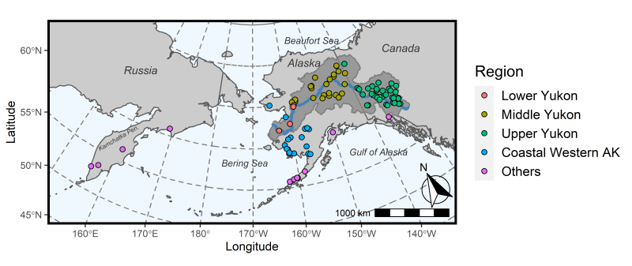

```{r, include = FALSE}
knitr::opts_chunk$set(
  collapse = TRUE,
  comment = "#>"
)
```

```{r setup}
library(Ms.GSI)
# devtools::load_all()

```

# Overview

This document contains the background information for a integrated multistage genetic stock identification (GSI) model in two parts. The first part the describes how to use package *Ms.GSI* to conduct a GSI analysis. The steps include formatting input data, running the integrated multistage GSI model, and summarizing results. The second part details the technical background of integrated multistage GSI model and its mathematical theory. There is a separate article describe the general background of the integrated multistage framework (*add link to integrated multistage paper*).

# How to use *Ms.GSI*

*Ms.GSI* follows the work flow: format input data, run integrated multistage model, and summarize results/convergence diagnostics.

## Input data

There are few pieces of information needed for input data set:

-   broad-scale baseline
-   regional baseline
-   mixture sample
-   broad-scale population information
-   regional population information

There are pre-loaded example data sets available in *Ms.GSI*. We will look at them one at a time. Note that the example data sets are simulated using existing baseline archived by the Alaska Department of Fish & Game Gene Conservation Lab (GCL). The fabricated data set does not represent the true population proportions in real fisheries. In this example, we made up a scenario similar to the Bering Sea groundfish fisheries where Chinook salmon harvested as bycatch originated from a wide range of geographic areas. Within the bycatch sample, we were interested in the proportion contribution from the lower, middle and upper Yukon River reporting groups (see map below). We used a coast-wide data set for Chinook salmon (Templin et al. 2011; Templin baseline hereafter) as the broad-scale baseline to separate Yukon River fish from other non-Yukon stocks in our data set during the first stage of the analysis. However, genetic markers in the Templin baseline were unable to clearly distinguish between lower Yukon River and other coastal western Alaska populations, so we used a second baseline with additional genetic markers that were specifically designed to differentiate Yukon River Chinook salmon populations (Lee et al. 2021; Yukon River baseline hereafter) as the regional fine-scale baseline for the second stage.

It is important to note that in the original grouping of the Templin baseline, Lower Yukon was a part of Coastal Western Alaska reporting group. We isolated Lower Yukon from the rest of the Coastal Western Alaska, but the accuracy of the proportion estimates would likely diminish because of the breakup of Coastal Western Alaska reporting group. We do not recommend using a genetic baseline beyond its original design. And researchers should be aware of the capability of their genetic baselines before utilizing them in the integrated multistage model. In our example, it would be ideal to keep the Coastal Western Alaska group intact in the broad-scale baseline, and break up the group into Lower Yukon and others using a fine-scale regional baseline. However, at the time of writing, such regional baseline with adequate resolution was still in development.  

{width="100%"}

We assembled a mixture sample containing 150 individuals from collection sites across Yukon River, coastal western Alaskan, Alaska Peninsula, Gulf of Alaska, and Kamchatka Peninsula (Russia). The collections were grouped into five reporting groups: Lower Yukon, Middle Yukon, Upper Yukon, Coastal Western Alaska (Coastal West Alaska), and Others.

### Mixture

First we will take a look at the baseline and mixture samples. *Ms.GSI* accepts the genotype information in two format: 1) GCL format or 2) package *rubias* format. The example data sets are in *rubias* format and naming convention, but procedures for GCL format are the same[^1].

[^1]: Note for the GCL folks: you don't need to transform GCL data sets to *rubias* format. *Ms.GSI* got you covered!

```{r}

print(dplyr::as_tibble(mix))

```

Columns 5 to 358 contain genotype information for loci in **BOTH** broad-scale and regional baselines. You do not have to specify the loci for each baseline (you can if you want to double check, more on that later). *Ms.GSI* matches the loci between mixture and baselines as long as the locus names are consistent.

If you have fish with known-origin, you can specify their identities by adding a column called `known_collection` in the mixture data set. The entry for known-origin should match the collection name in the broad-scale baseline. Fish with unknown-origin should have a `NA` entry.

### Broad-scale baseline

Next, we will take a look at the broad-scale (Templin) baseline example provided in *Ms.GSI*. There are originally 45 loci in the Templin baseline, but we reduced the marker set to 28 loci due to limitation on the data size (and other technical reasons). However, for demonstration purpose, this data set will suffice.

```{r}

print(dplyr::as_tibble(base_templin))

```

### Regional baseline

The regional baseline (Yukon) is in the same format. There are originally 380 loci in the Yukon River Chinook baseline, but we reduced the numbers to 177 in this demonstration.

```{r}

print(dplyr::as_tibble(base_yukon))

```

### Population information

Another piece of information needed is the population details for each baseline. You need to include three columns in the population information table. Column `collection` contains the names for each population in the baseline. Column `reunit` specifies the reporting group each population belongs to. Column `grpvec` specifies the identification number for each reporting group. Below shows the first ten rows of population information for the Templin (broad-scale) baseline.

```{r}

print(dplyr::as_tibble(templin_pops211))

```

If you have hatchery populations in your mixture sample, you can tell *Ms.GSI* either a collection belongs to natural or hatchery-origin by adding an `origin` column in the population information table. In the `origin` column, you identify each collection with `"wild"` or `"hatchery"`. If you don't care to separate natural and hatchery origins, you can lump them in one collection. In this case, you don't need to add an `origin` column. Also, this option to identify hatchery fish is only available in the broad-scale baseline, so don't add an `origin` column in the population table for regional baseline.

Population information table for the Yukon (regional) baseline is in the same format, but not necessarily in the same order.

```{r}

print(dplyr::as_tibble(yukon_pops50))

```

Once you have the data files ready (I recommend saving them as .Rdata or .Rds files), you can use `prep_msgsi_data()` function to convert them into input data set for model run. You'll also need to identify "groups of interest" in parameter `sub-group`. In this example, groups of interests are Lower Yukon, Middle Yukon and Upper Yukon reporting groups. Their identify numbers are 3, 4, and 5 in the broad-scale baseline. There's an option to save the input data at a designated directory by identifying the location in parameter `file_path`.

`prep_msgsi_data()` function matches the loci between mixture and baselines. But if you want to make sure that you didn't miss any locus in your baselines or mixture, you can manually provide loci names (in string vector) for each baseline by inputting them in `loci1` and `loci2`. In this example we don't manually provide lists of loci because we trust that mixture and baselines all have the correct loci.

```{r}

msgsi_dat <-
  prep_msgsi_data(mixture_data = mix,
  baseline1_data = base_templin, baseline2_data = base_yukon,
  pop1_info = templin_pops211, pop2_info = yukon_pops50, sub_group = 3:5)

```

`prep_msgsi_data()` formats the data files and put them in a list. It took few seconds to format the input data in this case. Bigger data sets may take longer. Here are the first few rows/items in the input data list:

```{r}

lapply(msgsi_dat, head)

```

## Genetic stock identification

Once your input data set is ready, you can use `msgsi_mdl()` to run the model. If you are used to running *rubias*, *Ms.GSI* might feel a bit slow. That is because 1) we are running two GSI models in tandem, so it takes twice as long than running a single model, and 2) *Ms.GSI* is written solely in *R*, which is not as computationally efficient as language *C*. So, why not code *Ms.GSI* in *C*? Because we're not technically advanced like the folks who developed *rubias* package (i.e., we don't know how to code in *C++*).

Because of the running time, we recommend running the integrated multistage model in conditional GSI mode (default setting). But there is an option to run the model in fully Bayesian mode if one choose to. If you run the model in fully Bayesian mode, you have the option to include numbers of adaptation run. Some people think that adaptation run encourages convergence in fully Bayesian mode. We have not test that theory but provide the option for those who want to try it.

We demonstrate the model run with one chains of 150 iterations (first 50 as warm-up runs, or burn-ins). We only run one chain in this example so it can pass CMD check while building the vignette document[^#]. In reality, you should **definitely** run multiple chains with more iterations. There are also options to keep the burn-ins and set random seed for reproducible results. We don't show them in this example though (but you can always `?msgsi_mdl`).

[^#]: The package we use to build *Ms.GSI* has an automated checking process. For some reason, automated check would fail if we ran multiple chains in our examples. Probably something to do with the parallel process we included in our function.

```{r}

msgsi_out <- msgsi_mdl(msgsi_dat, nreps = 150, nburn = 50, thin = 1, nchains = 1)

```

## Summarizing results

### Stock proportions

The output of model contains nine items: `summ_t1`, `trace_t1`, `summ_t2`, `trace_t2`, `summ_comb`, `trace_comb`, `comb_groups`, `comb_groups`, `iden_t1` and `idens_t2`. Items with "summ" are summary for reporting group proportions and associated convergence diagnostics. If you want to see summaries for stage one and two individually, `summ_t1` and `summ_t2` will show you that. Most people probably want to see the combined summary, `summ_comb`.

```{r}

msgsi_out$summ_comb

```

Most column names are self explanatory, but others might need some additional descriptions. `ci.05` and `ci.95` are the lower and upper bounds of 90% credible interval. `p0` is the probability of an estimate equals zero. We estimate `p0` by calculating the portion of posterior samples that is less than $5 \times 10^{-7}$. `GR` is the Gelman-Rubin statistic (a.k.a. $\hat R$). In this example, Gelman-Rubin statistic is not calculated because we only run one chain. `n_eff` is the effective size, or $N_{eff}$. We will not discuss how to diagnose convergence in this document. Please consult Gelman et al. 2014, Gelman & Rubin 1992, Brooks & Gelman 1998 and other literature on statistical methods.

Items with "trace" are the posterior sample history, or trace history, for either stage one, two, or combined. Trace history is needed for making trace plots. And if you need to combine reporting groups proportions or combine variance, trace histories are what you need. `trace_` items are tibbles with each collection as a column. There are two additional columns, `itr` and `chain`, to identify Markov chain Monte Carlo (MCMC) sampling iteration and chain.

`comb_groups` are provided in the output as reference for functions making trace plots (`tr_plot()`) and stratified estimator (`stratified_estimator_msgsi()`). Grouping for stage one and two can also be found in the input data.

```{r}

msgsi_out$trace_comb

```

### Individual assignments

The last two items in the output are the identity assignment history of each individual in the mixture sample. Each column represents an individual in the mixture, and each row records the identity assigned during each iteration in each chain. These numbers are the population identifiers in the same order as your population information files (and baseline files). Individuals are ordered in the same as the input data (i.e., mixture data).

```{r}

msgsi_out$idens_t1

```

Individual identity output in this format may not be very useful for most users. So, *Ms.GSI* has a function `indiv_assign()` that summarize the reporting group assignment probabilities for each individual in the mixture.

```{r}

indiv_assign(mdl_out = msgsi_out, mdl_dat = msgsi_dat)

```

The summary for individual assignment has a column named `ID` that identifies each individual in the mixture. The reporting groups represent the combined grouping of the broad and regional baselines. Probabilities in each row should sum up to one.

### Trace plot

*Ms.GSI* has a function for you to make trace plot and examine the mixing of MCMC chains. Don't forget to include the group information (as in `groups`, `p2_groups`, or `comb_groups`) for the trace history that you want to plot.

```{r, fig.height=12, fig.width=8, out.width="100%", fig.cap="Trace plots for reporting group proportions."}

tr_plot(obj = msgsi_out$trace_comb, pop_info = msgsi_out$comb_groups)

```

### Stratified estimator

`stratified_estimator-msgsi()` function combines the stock group estimates of multiple mixtures (i.e., strata) weighted by harvest numbers or fishing efforts. It is designed to work in the same way as the `stratified_estimator_rubias()` function from the *GCLr* package by the GCL, although the input format is slightly different. To do so, you would save the *Ms.GSI* output for each mixture in a separate folder under your preferred directory, then specify the path by `stratified_estimator_rubias(path = ...)`.

`stratified_estimator-msgsi()` can also combine variances of different sources for a single mixture. That is, if you want to convert your total harvest number (with CV provided) to harvest for individual reporting groups, `stratified_estimator-msgsi()` can do that. In this case, we use the example model output with a new grouping:

```{r}
new_groups <- msgsi_out$summ_comb |>
  dplyr::select(group) |>
  dplyr::mutate(new_repunit = c(rep("Broad", 9), rep("Regional", 3))) |>
  dplyr::rename(repunit = group)

stratified_estimator_msgsi(mdl_out = msgsi_out, mixvec = "Bering example",
                           catchvec = 500, cv = 0.1, new_pop_info = new_groups)

```


# Methods (math!)

## Pella-Masuda Model

This integrated multistage GSI model is essentially two Bayesian GSI models stacked on top of each other; hence the name "multistage." The Pella-Masuda model (Pella & Masuda 2001) is the Bayesian GSI model that make up each stage in the integrated multistage model. We will first describe the Pella-Masuda model before discussing the development of a integrated multistage model.

In a group of mixed populations, Pella-Masuda model assigns population identities to each individual based on its genetic make-up (e.g. genotype). Then the model estimates the overall population proportions based on the numbers of individuals assigned to each population. In the fishery context, genetic data of the individuals is called the mixture sample because it consists multi-locus genotype of individual fish collected from a mixed-stock fishery. $\mathbf x$ denotes the mixture sample. In this document, a bold-font letter represents a *number set*, or a collection of distinct elements. For example, $\mathbf x$ is a set that contains individual $x$ elements. And $x_{m,l,j}$ is the count of allele $j$ in locus $l$ for individual fish $m$, where $m \in \{1,2,...,M\}$, $l \in \{1,2,...,L\}$, and $j \in \{1,2,...,J_l\}$ depends on locus $l$.

Genetic data of the populations is called the baseline sample because it consists genotype compositions of various baseline populations collected at their spawning locations. Researchers select sampling locations to best represent the populations in an area. $\mathbf y$ denotes the baseline sample. $y_{k,l,j}$ is the count of allele $j$ in locus $l$ for a sample of size $n_{k,l}$ collected from baseline population $k$, where $k \in \{1,2,...,K\}$.

For both mixture and baseline samples, it is assumed that allele counts in each locus follow a multinomial distribution[^2]. Using another made-up example, in a baseline sample, there are two allele types in locus 1 for population 2. Counts for the two alleles are $y_{1,2,1}, y_{1,2,2}$, and they follow a multinomial distribution with parameters $q_{1,2,1}, q_{1,2,2}$ and size $n_{2,1}$. Note that $q_{1,2,1}, q_{1,2,2}$ are the relative frequencies of the two alleles in locus 1 for population 2. In a Bayesian framework, we need to specify prior distributions for parameters; therefore, we place a Dirichlet[^3] prior distribution on $q_{1,2,1}, q_{1,2,2}$ with hyperparameters[^4] $\beta_{1,1}, \beta_{1,2}$. Usually we set the priors to be equal for all loci. In this example, let $\beta_{1,1} = \beta_{1,2} = 1/2$ based on the number of alleles for locus 1.

[^2]: What is a multinomial distribution? They are the counts of multiple categories based on their corresponding probabilities. For example, we randomly toss 10 Swedish Fish to three kids. Each time we toss a fish, the probability of kid #1 catching it is 0.3, kid #2, 0.3, and kid #3, 0.4. The numbers of fish caught by the three kids are multinomially distributed with probabilities = {0.3, 0.3, 0.4} and a total size 10.

[^3]: What is a Dirichlet distribution? Using the same example for multinomial distribution, the fish catching probabilities of all three kids are Dirichlet-distributed with fish counts of all three kids as parameters. It is worth noting that the parameters do not have to be integers as long as they are \> 0.

[^4]: A hyperparameter is a parameter of a prior distribution.

$\mathbf q$ represents $q_{1,2,1}$ and $q_{1,2,2}$, together with allele frequencies of other loci and other populations. As you can see, $\mathbf q$ and $\mathbf y$ have the same dimension because each relative frequency corresponds to an allele count. In the model, allele frequencies of baseline populations, $\mathbf q$, determine population proportions. And population proportions determines the identities of individual fish. Individual identities are then tallied and summarized to update baseline allele frequencies. $\mathbf y$ can be expressed as follows:

$\mathbf y_k \sim Mult(\mathbf n_k, \mathbf q_k)$

Prior distribution for $\mathbf q$:

$\mathbf q_k \sim Dirich(\mathbf \beta)$,

where $\mathbf \beta = 1/J_l$

For mixture sample, allele counts in each locus of individual fish also follows a multinomial distributions. If a fish came from a certain population, its distribution of allele counts should resemble the allele frequencies of the baseline population which it came from. However, the identity of the individual fish is unknown so it needs to be estimated. Here we let $\mathbf z_m$ represent the population identify for the $m$^th^ mixture individual. $\mathbf z_m$ is composed of 0's and an 1 with a length $K$ (e.g. number of baseline populations). $z_{m,k} = 1$ if individual $m$ belongs to population $k$, and $z_{m,k} = 0$ otherwise. In a made-up example, $\mathbf z_{100} = \{0, 0, 1, 0, 0\}$ means that there are five baseline populations, and individual fish #100 comes from population 3.

We place a multinomial prior on $z_{m,1}, z_{m,2}, ..., z_{m,K}$ with size 1 and probabilities equal to population proportions $p_1, p_2, ..., p_K$. We specify a Dirichlet prior distribution on $p_1, p_2, ..., p_K$ with hyperparameters $\alpha_1, \alpha_2, ..., \alpha_K$, where $\alpha_1 = \alpha_2 = ... = \alpha_K = 1/K$. We usually set $\alpha$ to be equal for all reporting groups, but they can be set based on prior knowledge in population proportions. We express $\mathbf z$ as follows:

$\mathbf z_m \sim Mult(\mathbf 1, \mathbf p)$

Prior distribution for $\mathbf p$:

$\mathbf p \sim Dirich(\mathbf \alpha)$,

where $\mathbf \alpha = 1/K$

As mentioned, for mixture sample, allele counts in each locus of individual fish follows a multinomial distributions. The parameters are allele frequencies of the corresponding baseline population with size the numbers of ploidy for each respective locus. Remember that population identity $z_{m,k} = 1$ if individual $m$ belongs to population $k$, and $z_{m,k} = 0$ otherwise. When multiplying population identities, $z_{m,1}, z_{m,2}, ..., z_{m,K}$, and allele frequencies of baseline populations, $\mathbf q_1, \mathbf q_2, ..., \mathbf q_K$, only allele frequencies of baseline population which individual $m$ belong to would remain while the rest goes to zero. $\mathbf x$ is expressed below. $\mathbf{ploidy} = ploidy_1, ploidy_2, ..., ploidy_L$ denotes ploidy for each locus.

$\mathbf x_m \sim Mult(\mathbf{ploidy}, \mathbf z_m \cdot \mathbf q)$

Moran and Anderson (2018) implement a genetic mixture analysis as a *R* package, *rubias*. Their program has been widely used by researchers around the world, including here at the GCL. *rubias* utilizes a model structure called the conditional genetic stock identification model, or the conditional GSI model, that is modified from the Pella-Masuda model. The main difference between the two models is that, in the conditional model, $\mathbf q$ is integrated out of the distribution of mixture sample, $\mathbf x_m$. That is, baseline allele frequencies are not being updated in the model. The result of that, $\mathbf x_m$ takes a form of a compound Dirichlet-multinomial distribution (Johnson at el. 1997):

$\mathbf x_m \sim CDM(\mathbf{ploidy}, \mathbf z_m \cdot \mathbf v)$,

where $\mathbf v$ is $\mathbf \beta + \mathbf y$. We are not going to attempt proving the theory behind the conditional model in this document (details can be found in Moran & Anderson 2018). But since $\mathbf q$ has been integrated out of $\mathbf x_m$, the process for estimating parameters is simpler and more streamlined. We have implemented conditional GSI in each stage of our integrated multistage model.

## Extend to multistage

In a multistage setting, we refer to a baseline that covers the whole range of a mixed stock fishery as a broad-scale baseline. The broad-scale baseline typically covers a wide range of geographic areas but does not have a comprehensive collection of reference populations nor genetic markers to resolve differences between local populations within a sub-region. These smaller sub-regions of a broad-scale baseline are covered by regional baselines with higher resolutions. We generalize the conditions of the *Ms.GSI* model to allow multiple regional baselines to be included, although we programmed *Ms.GSI* to deal with only one regional baseline vs. one broad-scale baseline.

Let there be $B$ populations in the broad-scale baseline and indexed as $b = 1, 2, ..., B$. Each of these broad-scale populations may belong to exactly 0 or 1 sub-region for which regional baselines might be available. These regional baselines have different sets of genetic markers than the broad-scale baseline and typically include additional populations that are not represented in the broad-scale baseline. Allow for there to be $R$ disjoint sub-regions indexed by $r$, with each sub-region represented by a distinctive regional baseline. We employ a superscript $^{(r)}$ upon variables to indicate a quantity associated with regional baseline $r$. Populations in different sub-regions cannot overlap, and each population only occurs once among the regional baselines. Let $k$ index the populations within these $R$ regional baselines and $K_r$ denotes the number of populations within regional baseline $r$.

In the *Ms.GSI* framework, the two stages are connected because the regional group membership of an individual is conditional on whether the broad-scale group membership of that individual belongs to the area of that particular sub-region. The following describes the conditional relationship between the broad-scale and the regional baselines:

$\mathbf z^{(r)}_m | \mathbf z_m, \mathbf {\mathscr B}^{(r)} = \begin{cases} \mathbf z^{(r)}_m & \text{if } \sum_{b \in \mathbf{\mathscr B}^{(r)}} z_{m,b}  = 1\\ \mathbf 0 & \text{otherwise} \end{cases}$,

where $\mathbf z_m$ and $\mathbf z^{(r)}_m$ are vectors of indicators ($0$ or $1$) identifying the broad-scale and regional populations that individual $m$ belongs to. $\mathbf{\mathscr B}^{(r)}$ denotes the broad-scale populations that belong to the areas represented by the reporting groups of region $r$, and $\mathbf 0$ is a vector of all zeros.

Ultimately, we want to estimate the fraction of individuals in the mixture that come from each of the sub-regional populations, as well as from any of the populations in the broad-scale baseline that are not associated with a regional baseline. $p^{(r)}_k$ denotes the mixture proportion of the $k$^th^ population in region $r$, and $p_b$ denotes the mixture proportion of population $b$ in the broad-scale baseline. Thus, we endeavor to estimate the mixture proportions $p^{(r)}_k$ for each $(r, k)$ such that $r = 1, 2, ..., R$ and $k = 1, 2, ..., K_r$ along with $p_b$, where $b \in \mathbf{\mathscr B_{*}}$, with $\mathbf{\mathscr B_{*}}$ denoting the broad-scale populations that do not belong to any areas represented by regional baselines. Lastly, we multiply $\mathbf {p}^{(r)}$ by $\sum_{b \in \mathbf{\mathscr B}^{(r)}} p_b$ for each region $r$, so the scaled $\mathbf{p}^{(r)}$ for all regions and $p_b$, where $b \in \mathbf{\mathscr B_{*}}$ would sum to one.

## Gibbs Sampler: where the fun go round and round

Deriving the values of parameters in each stage of the integrated multistage model requires finding the joint posterior distribution of Pella-Masuda model in each stage, $\mathbf p, \mathbf q,\mathbf z, \mathbf y, \mathbf\alpha, \mathbf\beta$. In this section, we will introduce the concepts and algorithm to sample from this posterior distribution in a single baseline Pella-Masuda model, which then can be extend to an integrated multistage framework.

Gibbs sampler is a type of MCMC methods that sequentially sample parameter values from a Markov chain. With enough sampling, the Markov chain will eventually converge to the desire distribution of interest. The most appealing quality of Gibbs sampler is its reduction of a multivariate problem (such as Pella-Masuda model) to a series of more manageable lower-dimensional problems. A full description of Gibbs sampler and MCMC methods is beyond the scope of this document; however, further information can be found in numerous resources devoting to Bayesian data analysis (see Carlin & Louis 2009; Robert & Casella 2010; Gelman et al. 2014)

To illustrate, suppose we would like to determine the joint posterior distribution of interest, $p(\mathbf \theta|\mathbf y)$, where $\mathbf \theta = \{\theta_1, \theta_2,..., \theta_K\}$. Most likely the multivariate $p(\mathbf \theta|\mathbf y)$ would be too complicated to sample from. However, if we can figure out how to break up the joint posterior distribution into individual full conditional distributions, each parameter in $\mathbf \theta$ can be sampled one by one sequentially using a Gibbs sampler algorithm. The process begins with an arbitrary set of starting values $\theta^{(0)}_2, \theta^{(0)}_3,..., \theta^{(0)}_K$ and proceeds as follows:

For $t = 1,2,...,T$, repeat

1.  Draw $\theta^{(t)}_1$ from $p(\theta_1|\theta^{(t-1)}_2, \theta^{(t-1)}_3,..., \theta^{(t-1)}_k, \mathbf y)$

2.  Draw $\theta^{(t)}_2$ from $p(\theta_2|\theta^{(t)}_1, \theta^{(t-1)}_3,..., \theta^{(t-1)}_k, \mathbf y)$

    ⋮

```{=html}
<!-- -->
```
k.  Draw $\theta^{(t)}_k$ from $p(\theta_k|\theta^{(t)}_1, \theta^{(t)}_2,..., \theta^{(t)}_{k-1}, \mathbf y)$

This would work best if the full conditionals are some known distributions that we can easily sample from (although it's not required). In our case with Pella-Masuda model, we rely on two main concepts, the Bayes theorem and conjugacy, to do the trick. Briefly, for estimating parameters $\mathbf\theta$ from data $\mathbf D$, according to Bayes Rule, $p(\mathbf\theta|\mathbf D) = \displaystyle \frac{p(\mathbf D|\mathbf\theta)p(\mathbf\theta)}{p(\mathbf D)}$. $p(\mathbf\theta|\mathbf D)$ is the joint posterior distribution for parameters $\mathbf\theta$, $p(\mathbf D|\mathbf\theta)$ is the likelihood of observing the data given the parameters, $p(\mathbf\theta)$ is the prior distribution of the parameters, and $p(\mathbf D)$ is the constant marginal distribution of the data. $p(\mathbf D)$ is often mathematically difficult to obtain; however, because $p(\mathbf D)$ is a constant number, we can ignore it by reducing the posterior distribution to $p(\mathbf\theta|\mathbf D) \propto p(\mathbf D|\mathbf\theta)p(\mathbf\theta)$.

So, how does Bayes Rule help us estimating parameters in the Pella-Masuda model? First, the joint posterior distribution has to be split up into smaller pieces. That is, we separate the joint posterior into likelihood of the data and priors for the parameters:

$p(\mathbf p, \mathbf q, \mathbf z, \mathbf y, \mathbf\alpha, \mathbf\beta)$

$\propto p(\mathbf x|\mathbf z, \mathbf q) p(\mathbf y|\mathbf q) \cdot p(\mathbf p|\mathbf\alpha) p(\mathbf q|\mathbf\beta) p(\mathbf z|\mathbf p)$

With some re-arrangements and hand-waving, we arrive at the full conditional distributions for $\mathbf q$ and $\mathbf p$:

$p(\mathbf x|\mathbf z, \mathbf q) p(\mathbf y|\mathbf q) \cdot p(\mathbf p|\mathbf\alpha) p(\mathbf q|\mathbf\beta) p(\mathbf z|\mathbf p)$

$= p(\mathbf x|\mathbf z, \mathbf q) p(\mathbf y|\mathbf q) p(\mathbf q|\mathbf\beta) \cdot p(\mathbf z|\mathbf p) p(\mathbf p|\mathbf\alpha)$

$\propto p(\mathbf x,\mathbf y,\mathbf z|\mathbf q) p(\mathbf q|\mathbf\beta) \cdot p(\mathbf z|\mathbf p) p(\mathbf p|\mathbf\alpha)$

$\propto p(\mathbf q|\mathbf x,\mathbf y,\mathbf z,\mathbf\beta) \cdot p(\mathbf p|\mathbf z,\mathbf\alpha)$

Next, we take advantage of a mathematical property called *conjugacy* to help us determine the conditional distributions. Based on this property, the posterior distribution follows the same parametric form as the prior distribution when prior is a *conjugate family* for the likelihood. For example, if the likelihood of data is binomial distribution and the prior of parameter is beta distribution, then the posterior is also beta distribution because beta is a conjugate family for binomial. There are many conjugate families, and Dirichlet and multinomial are another example.

Utilizing conjugacy property, we will determine each of the full conditional distributions for $\mathbf q$ and $\mathbf p$.

### Conditional distribution p(q\|x, y, z, $\beta$)

We determine that $p(\mathbf q|\mathbf x, \mathbf y, \mathbf z, \mathbf \beta)$ is Dirichlet-distributed because Dirichlet prior $p(\mathbf q|\mathbf \beta)$ is a conjugate family for the multinomial likelihoods $p(\mathbf x|\mathbf z, \mathbf q)$ and $p(\mathbf y|\mathbf q)$. To determine the exact parameterization for the posterior distribution, we need to derive the prior and likelihoods first.

Likelihood $p(\mathbf x|\mathbf z, \mathbf q)$ can be derived in two steps. The first step we conditioned the likelihood on $\mathbf z$ so that

$p(\mathbf x|\mathbf z, \mathbf q) \propto \displaystyle \prod^{M}_{m=1} \prod^{K}_{k=1} [f(\mathbf x_m|\mathbf q_k)]^{z_{m,k}}$,

where $f(\mathbf x_m|\mathbf q_k)$ is the relative frequency of multi-locus genotype for individual $m$ in population $k$. In the next step, we derive $f(\mathbf x_m|\mathbf q_k)$:

$f(\mathbf x_m|\mathbf q_k) \propto \displaystyle \prod^{L}_{l=1} \prod^{J_l}_{j=1} q^{x_{m,l,j}}_{k,l,j}$

Then we combine the two,

$p(\mathbf x|\mathbf z, \mathbf q) \propto \displaystyle \prod^{M}_{m=1} \prod^{K}_{k=1} [f(\mathbf x_m|\mathbf q_k)]^{z_{m,k}}$

$\propto \displaystyle \prod^{M}_{m=1} \prod^{K}_{k=1} [\displaystyle \prod^{L}_{l=1} \prod^{J_l}_{j=1} q^{x_{m,l,j} \cdot z_{m,k}}_{k,l,j}]$

$\propto \displaystyle \prod^{K}_{k=1} \prod^{L}_{l=1} \prod^{J_l}_{j=1} q^{\sum^{M}_{m=1} (x_{m,l,j} \cdot z_{m,k})}_{k,l,j}$

Deriving likelihood $p(\mathbf y|\mathbf q)$ is more straightforward. It is the product of relative frequency of multi-locus genotype for each population:

$p(\mathbf y|\mathbf q) \propto \displaystyle \prod^{K}_{k=1} \prod^{L}_{l=1} \prod^{J_l}_{j=1} q^{y_{k,l,j}}_{k,l,j}$

And $p(q|\mathbf \beta)$ is Dirichlet prior distribution. Its probability density has a kernel[^6] of $\mathbf q^{\mathbf \beta - 1}$. We can express the likelihood as

[^6]: Without involving too much math, *kernel* here refers to what is left over after factoring out the constant from a probability density function (PDF). For example, The PDF of Dirichlet distribution is $\frac{1}{B(\mathbf \alpha)} \displaystyle \prod^K_{i=1} x^{\alpha_i - 1}_i$. Beta function $B(\mathbf \alpha)$ can be factored out, and $\displaystyle \prod^K_{i=1} x^{\alpha_i - 1}_i$ is the kernel.

$p(\mathbf q|\mathbf \beta) \propto \displaystyle \prod^{K}_{k=1} \prod^{L}_{l=1} \prod^{J_l}_{j=1} q^{\beta_{l,j} - 1}_{k,l,j}$.

Put all the likelihoods together,

$p(\mathbf q|\mathbf x,\mathbf y,\mathbf z,\mathbf\beta) \propto p(\mathbf x|\mathbf z, \mathbf q) p(\mathbf y|\mathbf q) p(\mathbf q|\mathbf\beta)$

$\propto \displaystyle \prod^{K}_{k=1} \prod^{L}_{l=1} \prod^{J_l}_{j=1} q^{\sum^{M}_{m=1} (x_{m,l,j} \cdot z_{m,k})}_{k,l,j} \cdot \displaystyle \prod^{K}_{k=1} \prod^{L}_{l=1} \prod^{J_l}_{j=1} q^{y_{k,l,j}}_{k,l,j} \cdot \displaystyle \prod^{K}_{k=1} \prod^{L}_{l=1} \prod^{J_l}_{j=1} q^{\beta_{l,j} - 1}_{k,l,j}$

$= \displaystyle \prod^{K}_{k=1} \prod^{L}_{l=1} \prod^{J_l}_{j=1} q^{\sum^{M}_{m=1} (x_{m,l,j} \cdot z_{m,k}) + y_{k,l,j} + \beta_{l,j} - 1}_{k,l,j}$

It is *elementary* to recognize that $\displaystyle \prod^{K}_{k=1} \prod^{L}_{l=1} \prod^{J_l}_{j=1} q^{\sum^{M}_{m=1} (x_{m,l,j} \cdot z_{m,k}) + y_{k,l,j} + \beta_{l,j} - 1}_{k,l,j}$ is the kernel for Dirichlet distribution. Hence,

$\mathbf q_{k,l}|\mathbf x,\mathbf y,\mathbf z,\mathbf\beta \sim Dirich(\displaystyle \sum^{M}_{m=1} x_{m,l,j} z_{m,k} + y_{k,l,j} + \beta_{l,j})$.

### Conditional distribution p(p\|z, $\alpha$)

Using the same logic as previously, $p(\mathbf p|\mathbf z,\mathbf\alpha)$ is also Dirichlet-distributed due to a Dirichlet prior $p(\mathbf p|\mathbf\alpha)$ and a multinomial likelihood $p(\mathbf z|\mathbf p)$.

$p(\mathbf p|\mathbf z,\mathbf\alpha) \propto p(\mathbf z|\mathbf p) p(\mathbf p|\mathbf\alpha)$

$\propto \displaystyle \prod^{M}_{m=1} \prod^{K}_{k=1} p^{z_{m,k}}_k \cdot \prod^{K}_{k=1} p^{\alpha_k - 1}_k$

$\propto \displaystyle \prod^{K}_{k=1} p^{\sum^M_{m=1}z_{m,k} + \alpha_k - 1}_k$

Once again, we recognize it as the kernel for Dirichlet distribution:

$\mathbf p|\mathbf z,\mathbf\alpha \sim Dirich(\displaystyle \sum^M_{m=1}z_{m,k} + \alpha_k)$

### Algorithm

There is one more distribution to figure out before we can start our Gibbs sampler routine (and you thought we're all set, lol). We would need to know how to sample $\mathbf z_m|\mathbf p, \mathbf q, \mathbf x_m$, the population identity for individual fish $m$ (in components 1 and 2) given the population proportions and genotype. If the probability of fish $m$ belong to population $k$ is $p_k$, and the likelihood of observing relative frequency of genotype for fish $m$ in population $k$ is $f(\mathbf x_m|\mathbf q_k)$, then the probability of fish $m$ belong to population $k$ given the population proportions and genotype is $\displaystyle \frac{p_k \cdot f(\mathbf x_m|\mathbf q_k)}{\sum^K_{k'=1}p_{k'} \cdot f(\mathbf x_m|\mathbf q_{k'})}$. The denominator should sum to one, so we only need to calculate the numerator.

$\mathbf z_m|\mathbf p, \mathbf q, \mathbf x_m$ has the following distribution:

$\mathbf z_m|\mathbf p, \mathbf q, \mathbf x_m \sim Mult(1, \mathbf{w}_m)$,

where $w_{m,k} = p_k \cdot f(\mathbf x_m|\mathbf q_k)$. We draw the initial values for $\mathbf q_k$ based on its prior distribution.

Once we figured out all the pieces in the Gibbs sampler for the single baseline framework, we can extend the concept to a multistage framework. Conceptually, we use a Gibbs sampler to sample from the full conditionals of $\mathbf q$, $\mathbf p$, $\mathbf z$, $\mathbf q^{(r)}$, $\mathbf p^{(r)}$, and $\mathbf z^{(r)}$. The full conditional distributions of the broad-scale baseline in the multistage framework stay the same as their counterparts in a single baseline framework. The full conditional distributions for the Gibbs sampler at the regional stage are:

$\mathbf q^{(r)}_{k,l} | \mathbf x^{(r)},\mathbf y^{(r)},\mathbf z^{(r)},\mathbf\beta^{(r)} \sim Dirich(\displaystyle \sum^{M}_{m=1} x^{(r)}_{m,l,j} z^{(r)}_{m,k} + y^{(r)}_{k,l,j} + \beta^{(r)}_{l,j})$,

$\mathbf p^{(r)} | \mathbf z^{(r)}, \mathbf z, \mathbf{\mathscr B}^{(r)}, \mathbf \alpha^{(r)} \sim Dirich(\displaystyle \sum^M_{m=1} (z^{(r)}_{m,k} | z_{m,b}, \mathscr B^{(r)}_{m,b}) + \alpha^{(r)}_k)$,

and $\mathbf z^{(r)}_m | \mathbf p^{(r)}, \mathbf q^{(r)}, \mathbf x^{(r)}_m \sim Mult(1, \mathbf{w}^{(r)}_m)$,

where $w^{(r)}_{m,k} \propto (p^{(r)}_k \cdot \displaystyle \prod^{L}_{l=1} \prod^{J_l}_{j=1} {q^{(r)}}^{x_{m,l,j}}_{k,l,j})$.

We initiate the Gibbs sampler with starting values for $\mathbf p^{(0)}$, $\mathbf q^{(0)}$, $\mathbf {p^{(r)}}^{(0)}$ and $\mathbf {q^{(r)}}^{(0)}$ based on their prior distributions. We use subscript $^{(t)}$ to denote $t$^th^ iteration of the Gibbs sampler. Sampling for the fully Bayesian model proceeds as follows:

For $t = 1,2,...,T$, repeat

1.  Determine the group memberships of mixture individuals at the broad-scale stage, $\mathbf z^{(t)}_m | \mathbf p^{(t-1)}, \mathbf q^{(t-1)}, \mathbf x_m \sim Mult(1, \mathbf{w}_m)$.

2.  Determine the group memberships of mixture individuals for each sub-region at the regional stage, ${\mathbf z^{(r)}_m}^{(t)} | {\mathbf p^{(r)}}^{(t-1)}, {\mathbf q^{(r)}}^{(t-1)}, \mathbf x_m^{(r)} \sim Mult(1, \mathbf{w}^{(r)}_m)$, $r = 1, 2, ..., R$.

3.  Draw updated values, $\mathbf q^{(t)}$, $\mathbf p^{(t)}$, ${{\mathbf q}^{(r)}}^{(t)}$ and ${{\mathbf p}^{(r)}}^{(t)}$ from $p(\mathbf q | \mathbf x, \mathbf y, \mathbf z^{(t)}, \mathbf \beta)$, $p(\mathbf p | \mathbf z^{(t)}, \mathbf \alpha)$, $p(\mathbf q^{(r)} | \mathbf x^{(r)}, \mathbf y^{(r)}, {\mathbf z^{(r)}}^{(t)}, \mathbf \beta^{(r)})$ and $p(\mathbf p^{(r)} | \mathbf {z^{(r)}}^{(t)}, \mathbf z^{(t)}, \mathbf{\mathscr B}^{(r)}, \mathbf \alpha^{(r)})$ respectively.

$T$ should be large enough to ensure the simulations converge to the posterior distribution. Usually it takes thousands of iterations. Implementing the conditional GSI model only requires a slight modification from the above algorithm. $\mathbf q$ and $\mathbf q^{(r)}$ only need to be calculated once at the initial step without further updates, otherwise the procedures remain the same.


# References

Brooks, S. P., and A. Gelman. 1998. General methods for monitoring convergence of iterative simulations. *Journal of Computational and Graphical Statistics*. 7:434--455.

Carlin, B. and T. Louis. 2009. *Bayesian Methods for Data Analysis, 3rd Edition*. CRC Press. New York.

Gelman, A., and D. B. Rubin. 1992. Inference from iterative simulation using multiple sequences. *Statistical Science*. 7:457--472.

Gelman, A., J. Carlin, H. Stern, D. Dunson, A. Vehtari and D. Rubin. 2014. *Bayesian Data Analysis, 3rd Edition*. CRC Press. New York.

Johnson, N.L., Kotz, S., and Balakrishnan, N. 1997. Discrete multivariate distributions. Wiley & Sons, New York.

Lee. E., T. Dann, and H. Hoyt. 2021. Yukon River Chinook Genetic Baseline Improvements. Yukon River Panel Restoration and Enhancement Fund Final Report, URE-163-19N.

Moran, B.M. and E.C. Anderson. 2018. Bayesian inference from the conditional genetic stock identification model. *Canadian Journal of Fisheries and Aquatic Sciences*. 76(4):551-560. <https://doi.org/10.1139/cjfas-2018-0016>

Pella, J. and M. Masuda. 2001. Bayesian methods for analysis of stock mixtures from genetic characters. *Fish. Bull.* 99:151--167.

Robert, C. and G. Casella. 2010. *Introducing Monte Carlo Methods with R*. Springer. New York.

Templin, W. D., J. E. Seeb, J. R. Jasper, A. W. Barclay, L. W. Seeb. 2011. Genetic differentiation of Alaska Chinook salmon: the missing link for migratory studies. *Mol Ecol Resour*. 11(Suppl 1):226-246. <doi:10.1111/j.1755-0998.2010.02968.x>.
